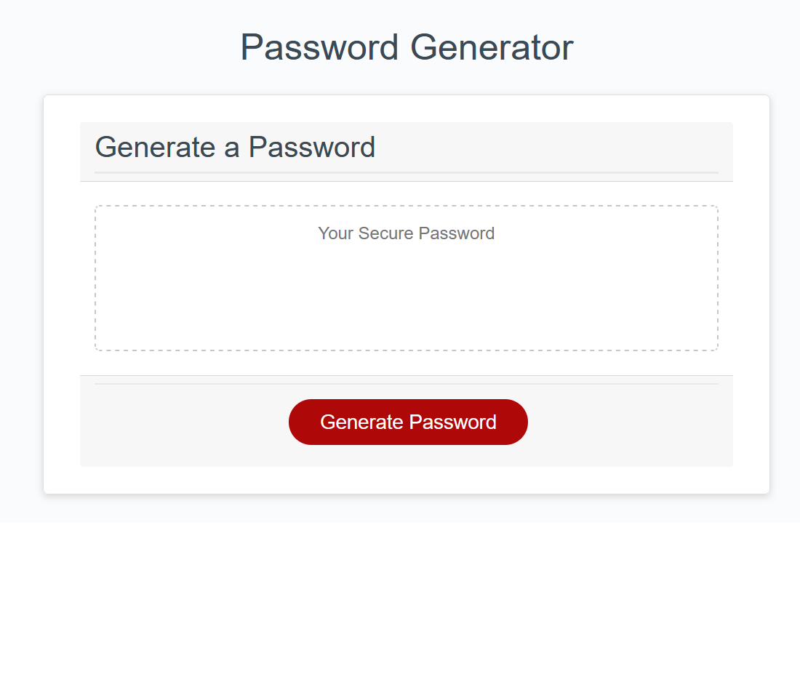
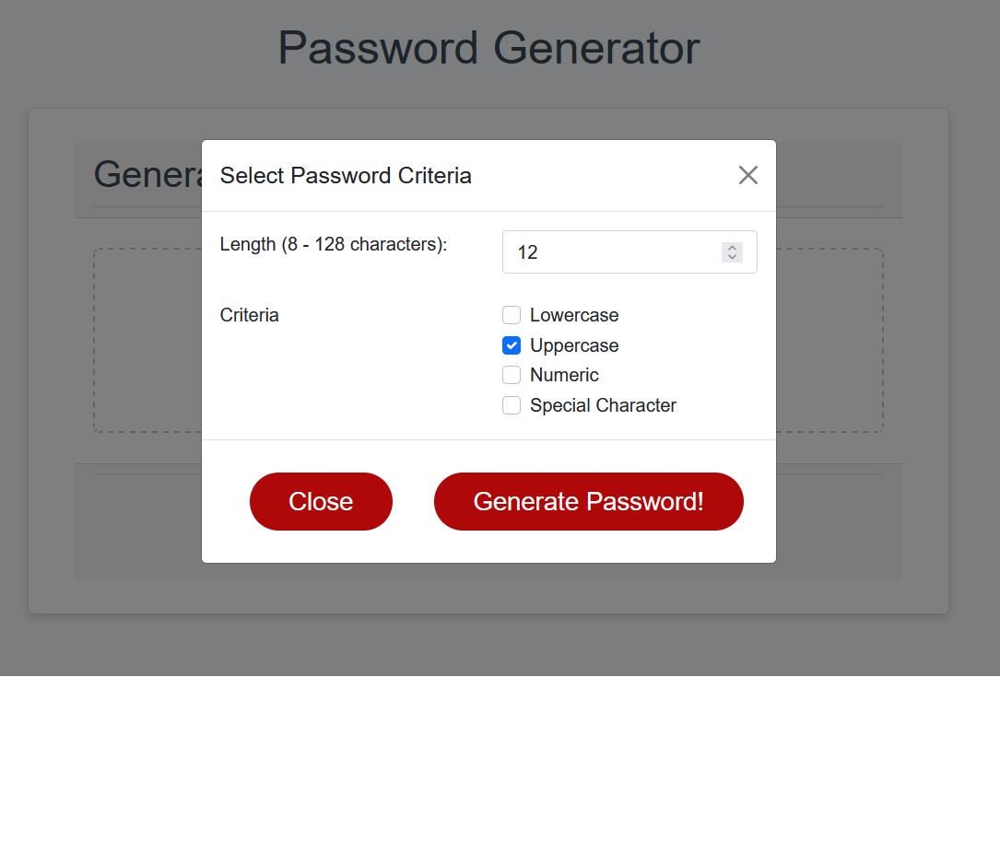
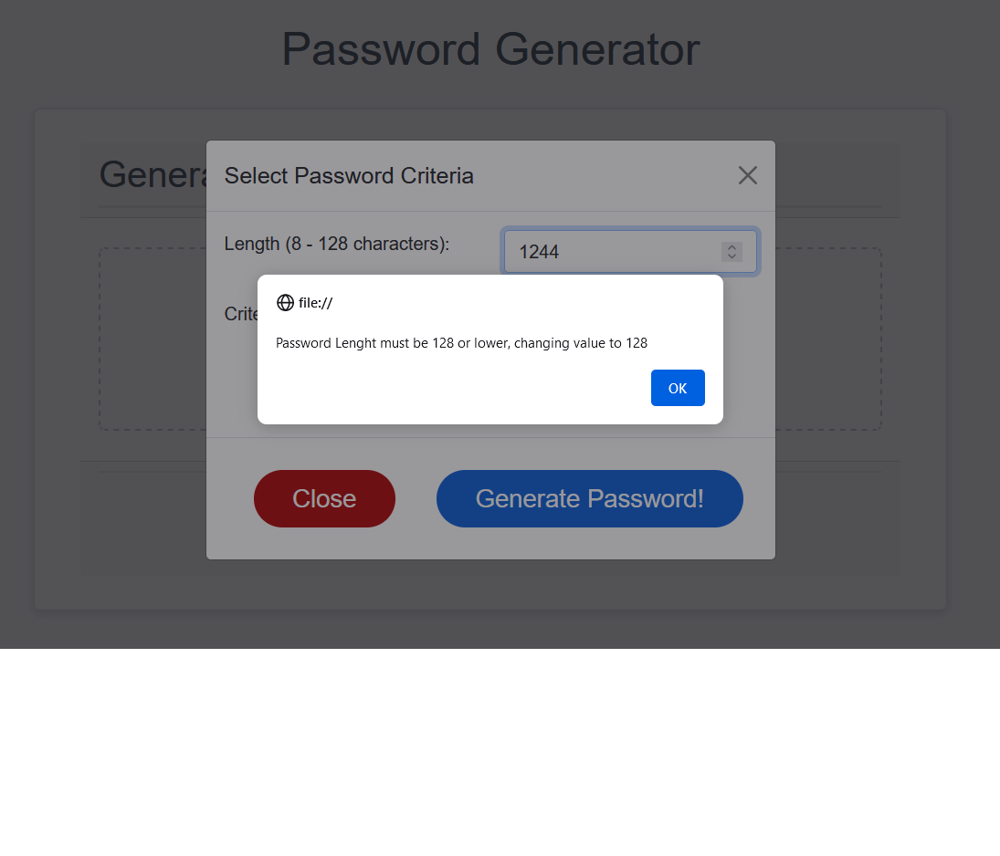
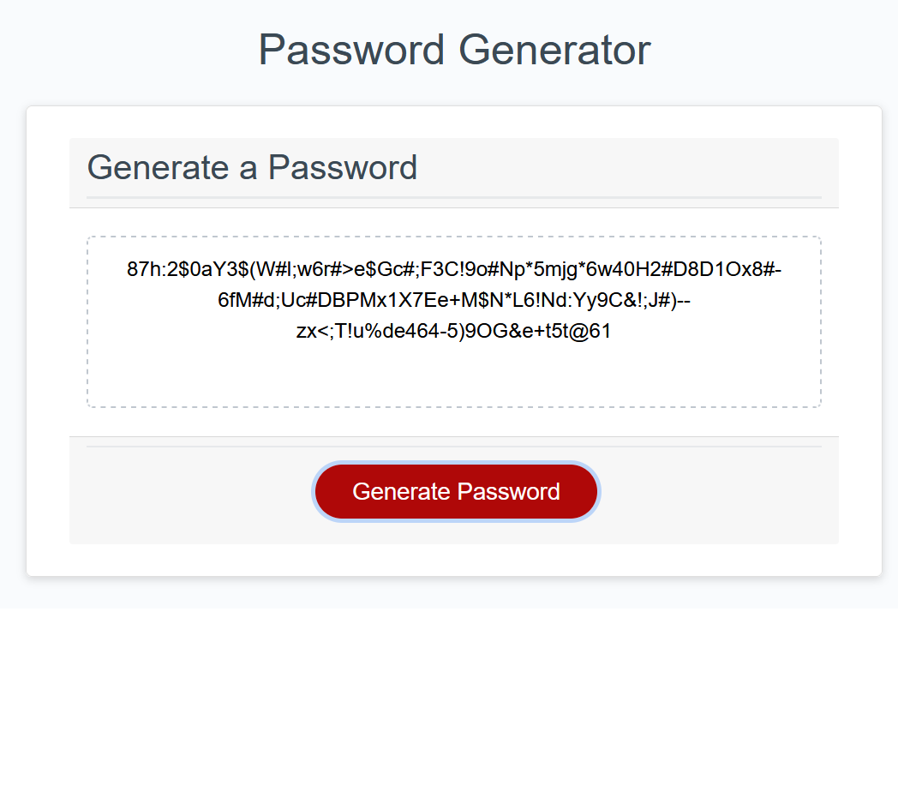

# password-generator

# Password Generator Starter Code

## Description
Project that generates random passwords, the main objective is that this program lets the user generates password
with certain criteria that the user selects or specifies like:
- password length
- special characters
- etc.

## Screenshot

# Initial Screen
 

# Criteria Selection

 

# Error message
 

# Generated Password
 

## Deployed Application
https://boro101094.github.io/password-generator/